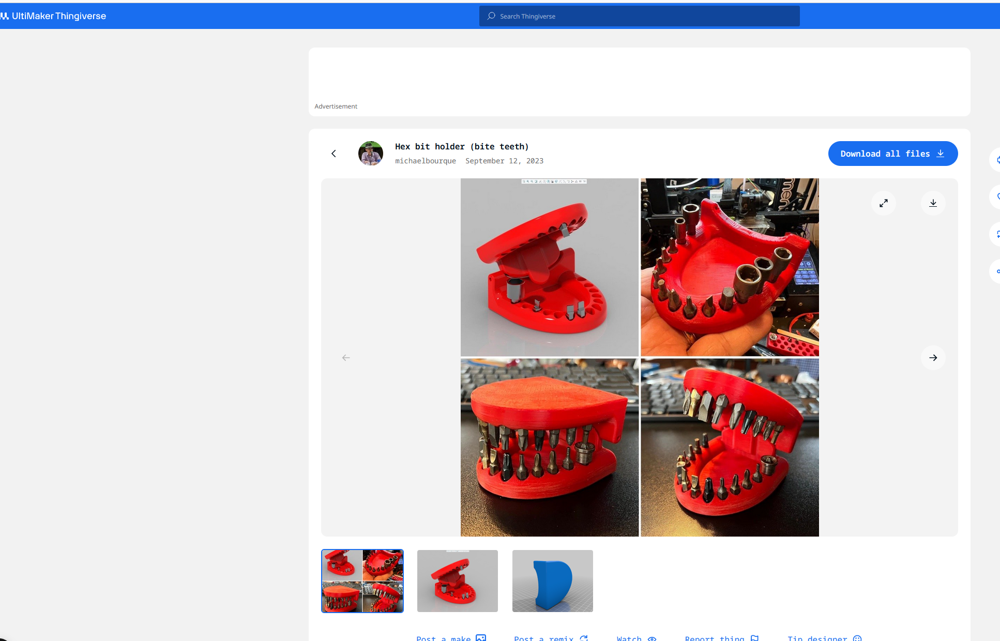
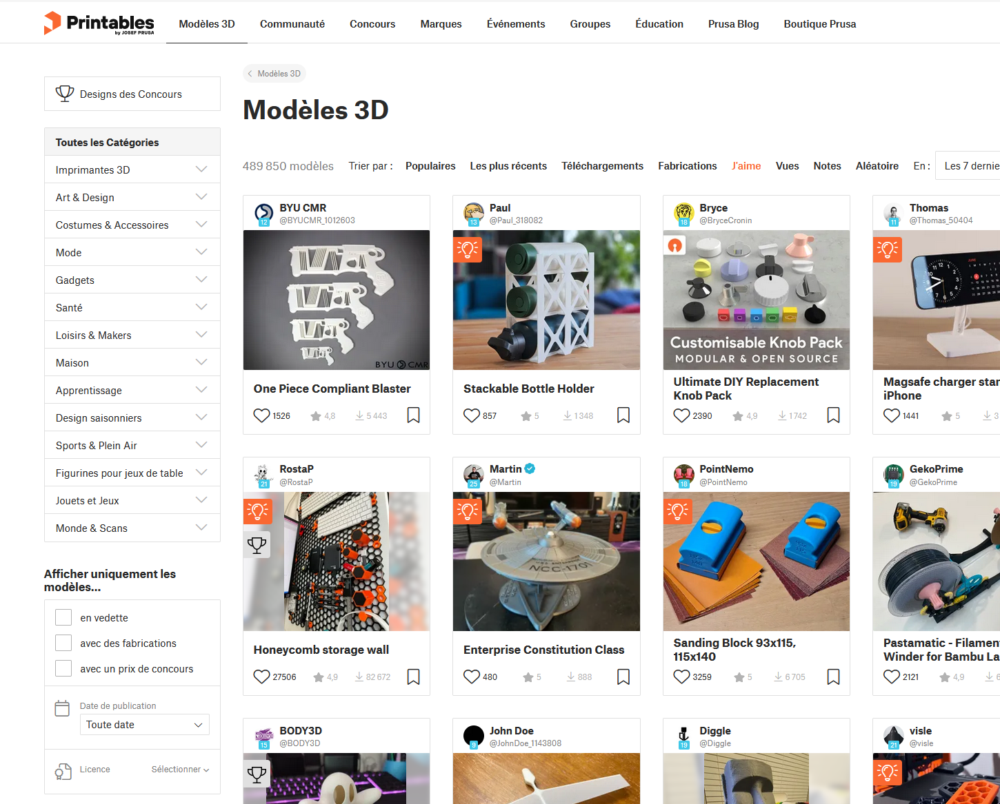

<!-- .slide: data-background="#000" class="chapter" -->

# Bibliothéques 3D

____

## Ne pas réinventer la roue

- Dans certains cas on peut éviter d'avoir à modéliser
    - On peut ne pas souhaiter faire la modélisation
    - Une modélisation qui nous semble trop complexe
___
*```soit on demande à quelqu'un qui peut aider dans ce domaine, soit on trouve le modèle sur les banques de téléchargement.```*

____

## Les banques de modèles 3D

Une foule de site propose des modèles en téléchargement: payant, gratuit, avec ou sans inscription. <!-- .element: class="fragment fade-in" data-fragment-index="1" -->

Comme pour tous téléchargements, veuillez à respecter la license qui l'accompagne. <!-- .element: class="fragment fade-in" data-fragment-index="2" -->

Ex: thingiverse, printables, cults3d, blendamator, grabcad, ... <!-- .element: class="fragment fade-in" data-fragment-index="3" -->

____

## Formats

- Deux possibilités:
  - soit on souhaite modifier le modèle avant de vouloir l'imprimer (l'adapter à son besoin)
  - soit on souhaite l'imprimer directement
  
On prendra alors le fichier .step ou le .stl selon le besoin.
___
*``` On ne rentrera pas dans le détails ici mais que ce soit un .stl ou un .step il pourra être modifiable par votre logiciel 3D ```*
___
____
## Exemple
Thingiverse et Printables pour les plus connues:
 <!-- .element height="40%" width="40%" -->
 <!-- .element height="40%" width="40%" -->

____
## Ca va trancher

Une fois qu'on a le modèle, on ne peut pas mettre directement le fichier sur l'imprimante.

L'imprimante a besoin qu'on lui traduise ce fichier en un langage qu'elle peut comprendre.
___
```le gcode```
___
Pas besoin de connaitre ce langage, des logiciels qu'on appel slicer font le travail de traduction pour nous en fonction de nos besoins d'impressions.

____
## Mais pas tout de suite

Avant de définir nos besoins, il faut comprendre ce qu'est une imprimante: <!-- .element: class="fragment fade-in" data-fragment-index="1" -->
- la différence entre une imprimante résine (SLA) et filaire (SDM): le trancheur, les contraintes et les résultats diffèrent <!-- .element: class="fragment fade-in" data-fragment-index="2" -->
- les caractéristiques selon la technologie <!-- .element: class="fragment fade-in" data-fragment-index="3" -->
- les possibilités selon ce que l'on souhaite faire <!-- .element: class="fragment fade-in" data-fragment-index="4" -->

Et prendre en compte ensuite ce que l'on veut imprimer: <!-- .element: class="fragment fade-in" data-fragment-index="5" -->
- solidité <!-- .element: class="fragment fade-in" data-fragment-index="5" -->
- finition / détails <!-- .element: class="fragment fade-in" data-fragment-index="5" -->
- matière <!-- .element: class="fragment fade-in" data-fragment-index="5" -->