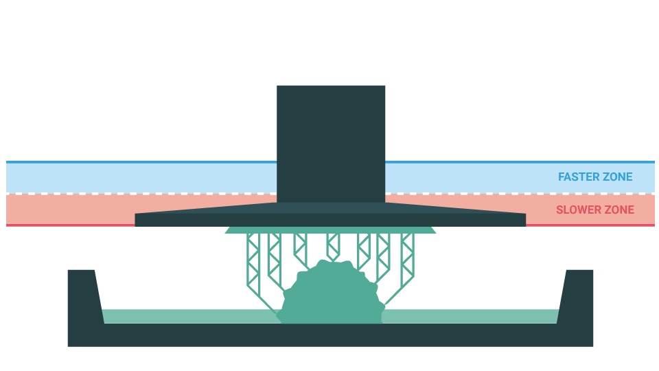
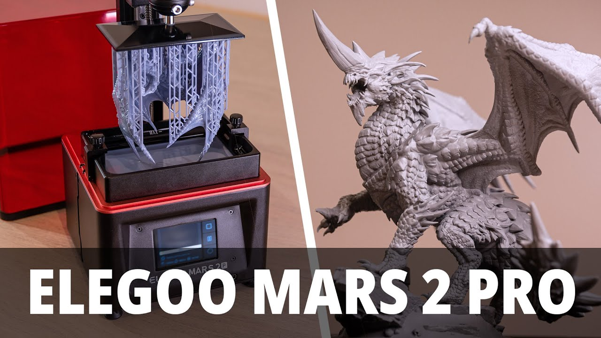
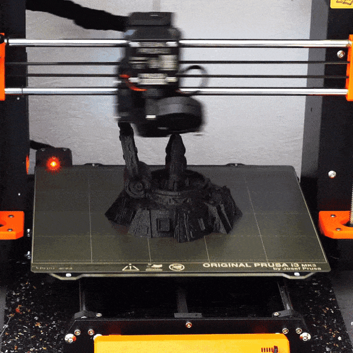
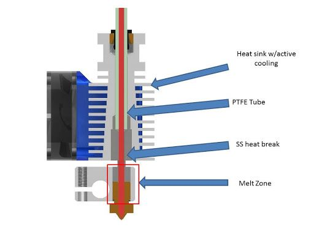
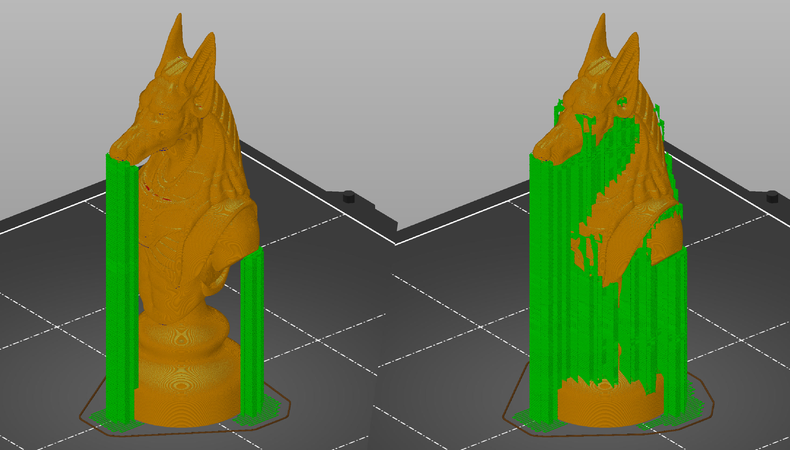

<!-- .slide: data-background="#000" class="chapter" -->
# Imprimante 3D 
____
## Qu'est ce qu'une imprimante 3D

Il faut différencier pour les imprimantes grands publiques entre SDM et SLA.

Autrement dit:
- Imprimante 3d à bobine de fil
- Imprimante 3d résine

Dans les deux cas, il s'agit de déposer de la matière couche par couche. On empile les couches 2D plus ou moins épaisse pour obtenir l'objet 3D. <!-- .element: class="fragment fade-in" data-fragment-index="1" -->
____

## Imprimante résine

Le principe est basé sur la solidification couche par couche de la résine photosensible via un écran sous le bac de résine. L'écran éclairera couche par couche la zone à solidifier pendant quelques secondes pendant que le plateau monte et descend en fonction de la hauteur de couche

 <!-- .element height="50%" width="60%" -->

____

## Imprimante résine 

L'impression résine s'est démocratisée avec différents constructeurs. Au Fablab nous disposons d'une elegoo Mars 2 Pro avec le bac de nettoyage et le bac de solidification UV. Les dernières imprimantes résines font de la 8k et 12k en définition.

 <!-- .element height="60%" width="60%" -->

____

## Imprimante résine: avantages

- Une qualité dans les détails assez exceptionnelle, particulièrement pour les figurines
- Des supports bien moins contraignant que pour l'impression à bobine de fil
- Des résines de différentes qualités, textures, couleurs
- Taux de réussite (c'est un peu du clé en mains)
- Pas besoin de penser à l'orientation de la pièce en fonction de la solidité voulue
- L'impression de petits objets
- L'impression de petites figurines en nombre
    - seule la hauteur d'impression impacte la durée d'impression: éclairer un petit carré ou l'écran entier prends autant de temps

____

## Imprimante résine: inconvénients

- La résine est visqueuse. Avec tous les problèmes qui vont avec (nettoyage du bac, toxicité, ...)
- Opération de post-traitement et nettoyage
    - passage dans un bac d'alcool pour nettoyer la pièce imprimée
    - passage dans une chambre chauffante sous UV pour solidifier
- La résine est souvent plus cassante (mais dépends des résines)

____

## Imprimante filaire

- La tête d'impression chauffe le fil ~200°C
- Un moteur qui pousse le fil dans la tête d'impression
- Un déplacement de la tête pour déposer la matière

 <!-- .element height="40%" width="40%" -->
 <!-- .element height="40%" width="40%" -->

____

## Imprimante filaire: avantages

- Peu ou pas de post-traitement
- Un matériau plastique recyclable (on peut avoir plusieurs type, on verra cela)
- Modularité: une communauté qui permet d'améliorer/réparer son imprimante si besoin
- Solidité des pièces selon le besoin
- Propreté: moins d'inconvénient et de traitement que la résine
- Rapidité pour les pièces à l'unité

____

## Imprimante filaire: inconvénients

- Complexité des pièces nécéssitant du support
- Trés compliqué d'avoir des pièces de trés petites tailles
- Moins de détails que la résine
- Plus de maintenance ou de cas d'échec:
    - Principalement lié à l'adhésion plateau

____

## Support kesaco ?

Une matière additionnelle pour permettre à l'impression de commencer a imprimer certaines parties en surplomb. L'impression 3D est cumulative, on ajoute de la matière couche par couche. Il est alors difficile de démarrer une couche sans couche précédente

 <!-- .element height="60%" width="60%" -->

____

## Le maillon manquant: le slicer

Le slicer (ou trancheur), c'est lui qui va générer le code que l'imprimante exécutera. L'imprimante lira ce code ligne par ligne pour produire couche après couche notre objet. Elle fera les déplacements en respectant ce code (ou l'éclairage de l'écran selon la technologie).  <!-- .element: class="fragment fade-in" data-fragment-index="1" -->

Nous donnerons au slicer nos préférences pour que l'imprimante sache si il y a des structures additionnelles comme les supports à ajouter mais aussi beaucoup d'autres paramètres qui permettront d'obtenir la pièce voulue et adaptée à l'utilisation qu'on en fera.  <!-- .element: class="fragment fade-in" data-fragment-index="2" -->

Il s'agit souvent d'un compromis entre qualité / robustesse / temps d'impression.  <!-- .element: class="fragment fade-in" data-fragment-index="3" -->