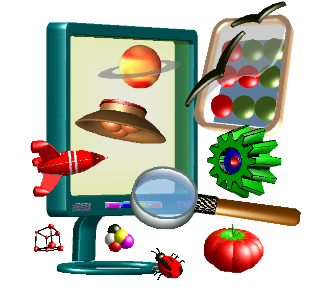
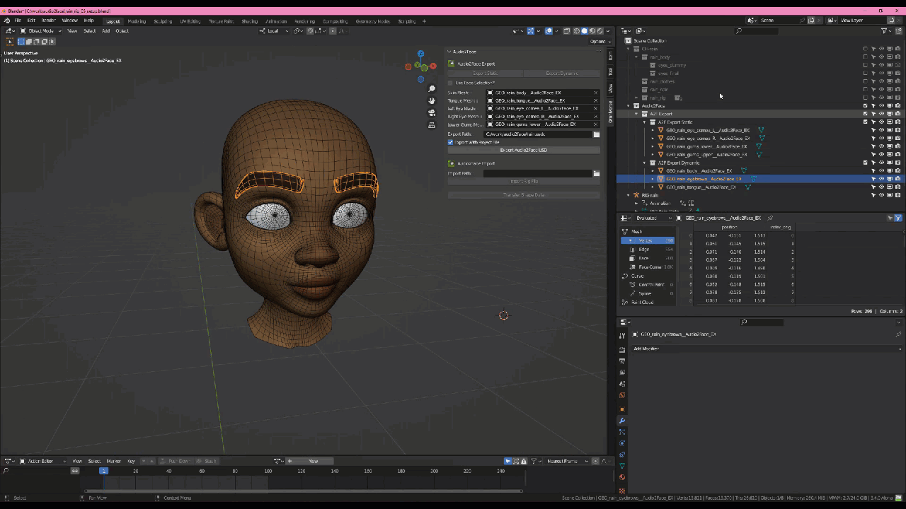
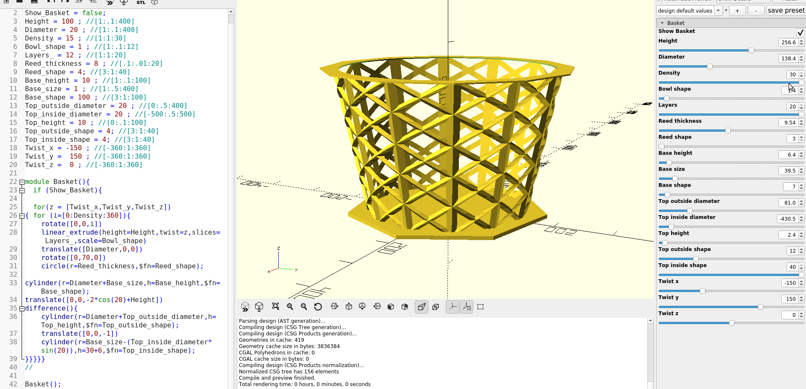
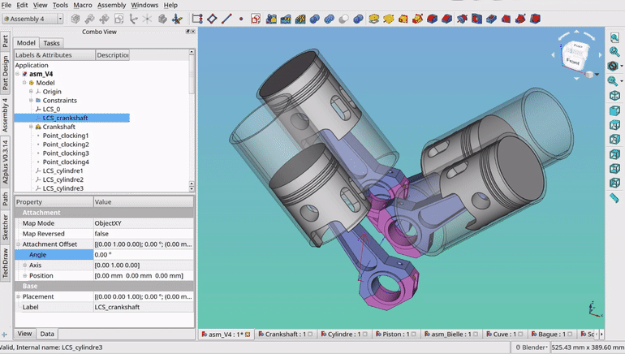
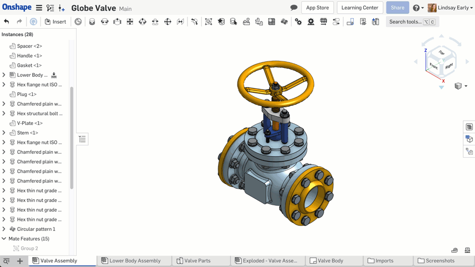
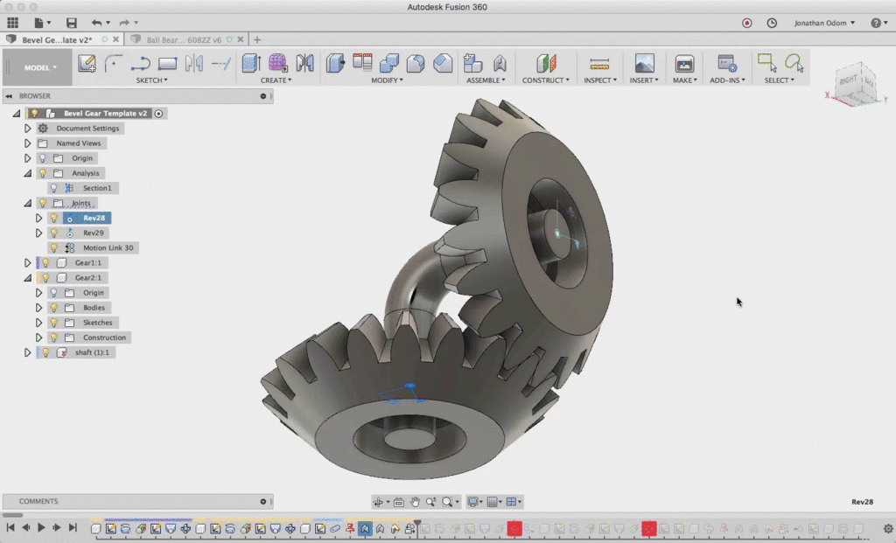
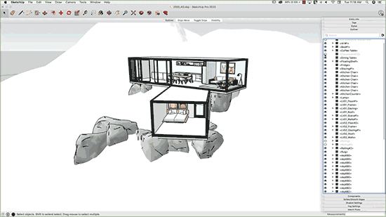
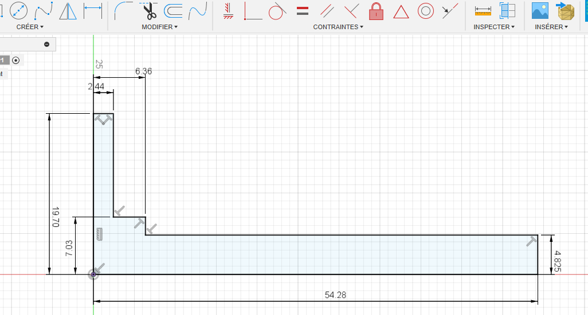
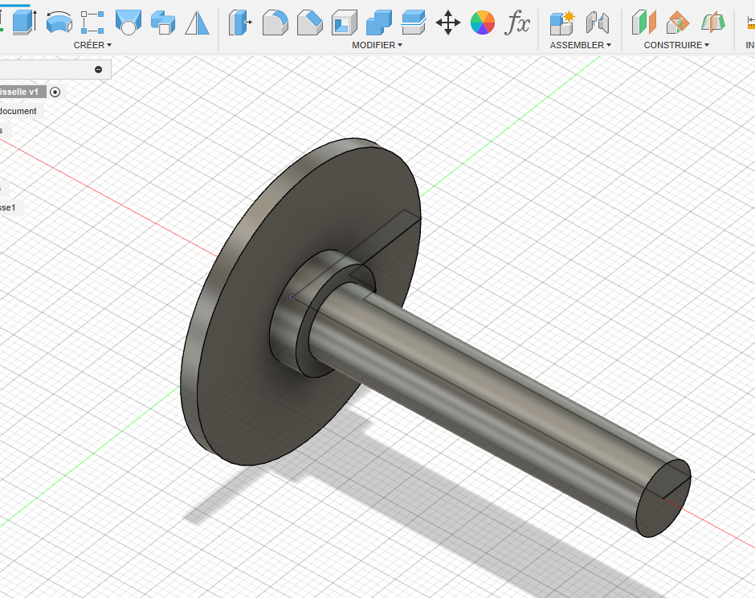
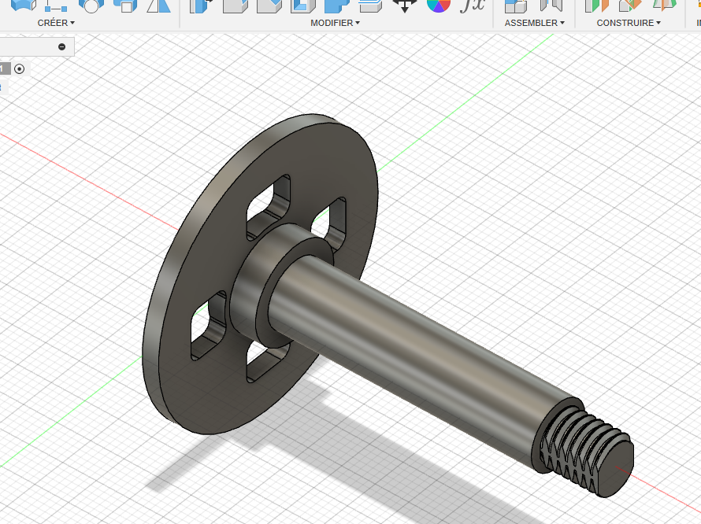

<!-- .slide: data-background="#000" class="chapter" -->

# Logiciels de modélisation 3D

____

### Qu'est ce qu'un logiciel de modélisation 3D ?
Un logiciel qui sert à créer des scènes 3D, composées de formes complexes, ou objets, en trois dimensions à partir de primitives de bases ou de définition analytique.

 <!-- .element height="20%" width="20%" -->

____

### Des solutions open-source
Blender, OpenSCAD, FreeCAD, ...

 <!-- .element height="40%" width="40%" class="fragment fade-in" data-fragment-index="1" -->
 <!-- .element height="45%" width="40%" class="fragment fade-in" data-fragment-index="2" -->
 <!-- .element height="40%" width="40%" class="fragment fade-in" data-fragment-index="3" -->

____

### Des solutions non open-source mais gratuite pour les particuliers
Onshape, Fusion360, Sketchup

 <!-- .element height="35%" width="35%" class="fragment fade-in" data-fragment-index="1" -->
 <!-- .element height="35%" width="35%" class="fragment fade-in" data-fragment-index="2" -->
 <!-- .element height="40%" width="35%" class="fragment fade-in" data-fragment-index="3" -->

____

### Des solutions professionnelles et payantes
AutoCAD, Catia, ...

____

### Des logiciels abordables par la pratique

- Commencer par des modélisations simples: boites, adaptateurs pour tuyau d'aspirateur ... <!-- .element: class="fragment fade-in" data-fragment-index="1" -->
- Prendre les côtes de ce que l'on souhaite dessiner <!-- .element: class="fragment fade-in" data-fragment-index="2" -->
- La modélisation d'objet est beaucoup plus abordable que la modélisation de caractère, personnage... <!-- .element: class="fragment fade-in" data-fragment-index="3" -->
- De nombreuses ressources et tutoriels sur internet (youtube notamment) <!-- .element: class="fragment fade-in" data-fragment-index="4" -->

____
### Exemple sous Fusion360: L'esquisse
 <!-- .element height="80%" width="80%" -->
____
### Exemple sous Fusion360: Le corps créé basé sur l'esquisse
 <!-- .element height="70%" width="70%" -->
____
### Exemple sous Fusion360: Le modèle finalisé
 <!-- .element height="70%" width="70%" -->
____

### Des formations au Fablab

- Des formations sur FreeCAD ont déjà été faites et sont encore prévues 
- Une formation sur Blender a été faite (orientée réalisation vidéo)
- A venir possiblement des formations Onshape ou/et Fusion360