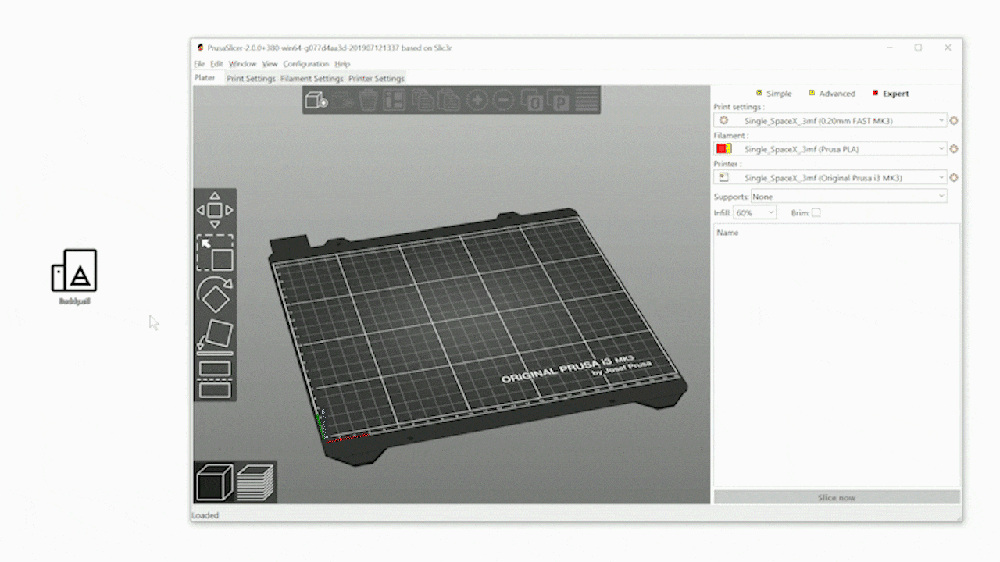
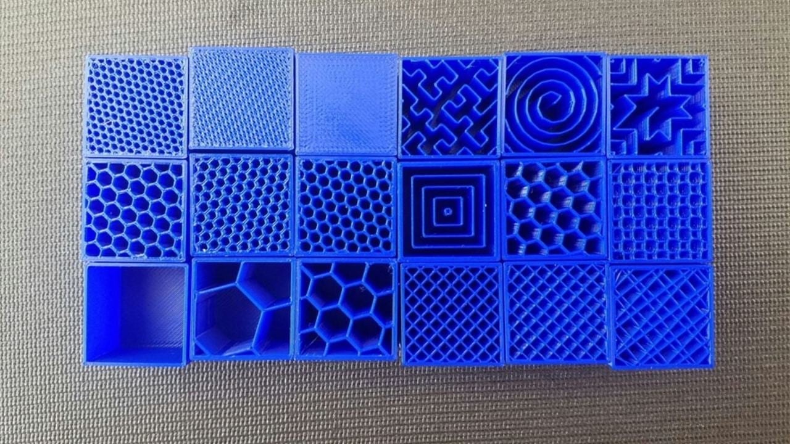
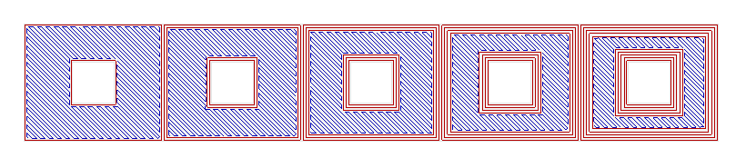
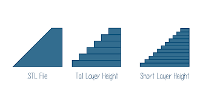
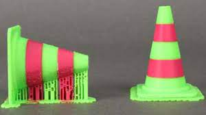
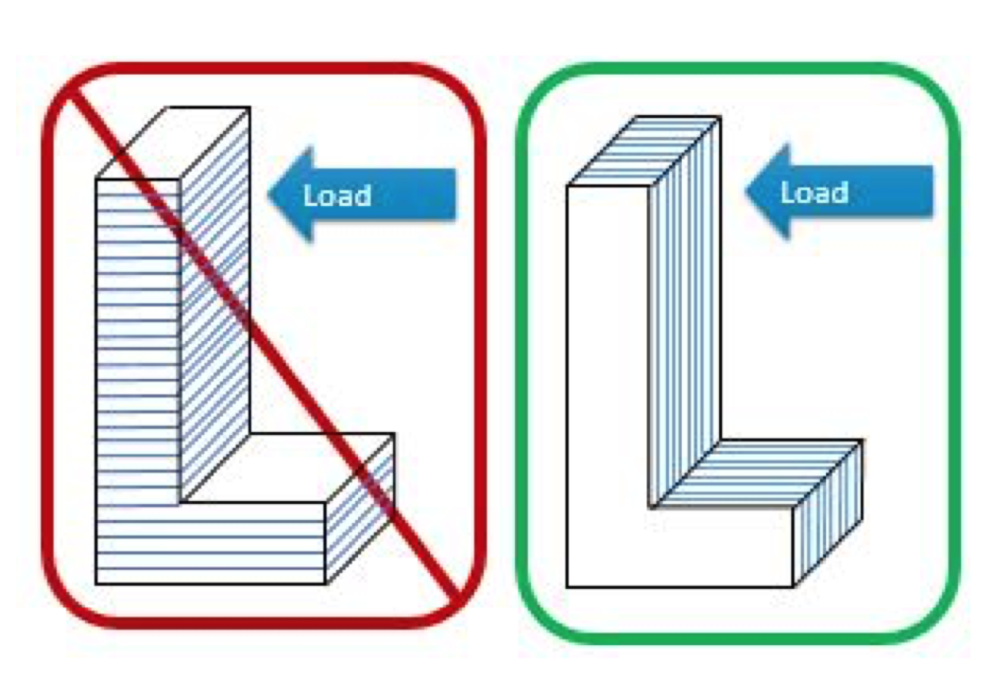

<!-- .slide: data-background="#000" class="chapter" -->

# Les slicers
____

## Aperçu
On passera rapidement pour ne garder qu'un exemple par type d'imprimante mais il existe différents logiciels qui font le même travail:
- transformer notre objet 3d en une suite de couche à imprimer.

____

## Slicer SDM: PrusaSlicer, Cura, OrcaSlicer, Creality K1 ... 

- on utilisera PrusaSlicer dans notre exemple <!-- .element: class="fragment fade-in" data-fragment-index="1" -->
- les termes sont communs à tous les slicers: support/perimètres/remplissage... <!-- .element: class="fragment fade-in" data-fragment-index="2" -->
- en général des profils standard sont à disposition sur le logiciel <!-- .element: class="fragment fade-in" data-fragment-index="3" -->

 <!-- .element height="40%" width="40%" -->

____

## Notion de base: Remplissage

Il s'agit de la densité de filament et du type de remplissage à utiliser. Cela impact le poids et la solidité (en général une valeur de 20% est correcte). On peut avoir plusieurs "pattern" de remplissage.

 <!-- .element height="60%" width="60%" -->

____

## Notion de base: Périmetres

Il s'agit du nombre de paroi exterieur que l'on veut faire. Améliore la solidité (environ 3 ou 4 en général)

 <!-- .element height="60%" width="80%" -->

____

## Notion de base: Premières couches

C'est le nombre de couches "solides" (remplie a 100%) faites au début de l'impression donc sur le plateau (entre 3 et 6 selon le besoin) <!-- .element: class="fragment fade-in" data-fragment-index="1" -->

La première couche sur le plateau a son importance car elle permet la bonne adhésion de la pièce pour le reste de l'impression ainsi que le bon rendu du dessous de la pièce une fois finit. <!-- .element: class="fragment fade-in" data-fragment-index="2" -->

Pour les pièces fines, qui n'ont pas une grande surface d'adhésion sur le plateau, on pourra ajouter une bordure via le logiciel.<!-- .element: class="fragment fade-in" data-fragment-index="3" -->
____

## Notion de base: Hauteur de couche

C'est la hauteur de couche qui permettra d'avoir un rendu plus "fin" mais plus la couche est fine plus le temps d'impression est long. Entre 0.1 et 0.2 on obtient un bon compromis.

 <!-- .element height="60%" width="80%" -->
____

## Notion de base: Dernières couches

Les dernières couches permettent une meilleure finition, entre 4 et 6 couches pour s'assurer de la solidité et du rendu, afin de ne plus voir le pattern de remplissage situé en dessous.

____

## Notion de base: Température

On ne peut pas parler de la température sans avoir vu les différents filaments possibles: PLA, ABS, PETG, TPU, ...

____

## Notion de bases: Filaments

Beaucoup de type de filaments existent, purement plastique ou incorporant des particules de bois, de cuivre etc...
Principalement on a:
- PLA: A base d'amidon de maïs, le plus recyclable et le plus facile à imprimer, l'un des plus costaud mais n'aime ni l'humidité ni les UV
- ABS: Exigeant pour l'impression, mais trés résistant aux intempéries (et donc trés peu bio-dégradable)
- TPU: un filament flexible qui permet des impressions avec une finition type caoutchou
- PETG: un compromis entre solidité et facilité d'impression

____

Au Fablab on utilise essentiellement PLA et ABS. Les températures sont souvent pré-reglées sur le logiciel et des valeurs indicatives sont affichées sur les bobines

____

## Notion de bases: Placement de la pièce

Dans l'impression filaire, l'orientation de la pièce à une importance majeure, tant dans le rendu de la pièce que dans sa solidité mécanique.

____

- Rendu de la pièce: une bonne orientation peut éviter certains supports et donc évite les marques associés à l'ajout de supports.

 <!-- .element height="40%" width="70%" -->

____

- Solidité: On cumule des couches, qui peuvent avoir quelques faiblesse sur la liaison intercouche. Il faut alors prendre en compte cette contrainte quand on oriente sa pièce.

 <!-- .element height="40%" width="70%" -->

____

## Pas de panique

En général vous n'avez pas besoin de toucher aux différents réglages. Il faut essentiellement se soucier de 5 choses:
- Quel filament j'utilise ?
- Comment j'oriente ma pièce ?
- Ai-je besoin d'activer l'ajout de support ?
- Quel détails en fonction du temps d'impression ? (+ de détail mais plus long)
- ma surface qui touche le plateau suffira t'elle a bien adhérer au plateau ?

____

## Slicer SLA: Chitubox, litchee slicer, ...

- on utilisera Chitubox mais litchee slicer semble aussi une bonne alternative.
- moins de notions spécifiques (périmètres, etc...), 3 notions principales:
  - évidage de la pièce
  - support
  - temps d'exposition

Des profils sont déjà présent sur chitubox.

____

##  Note de base: Evidage
 
Une pièce en résine n'a pas besoin d'être pleine, on peut l'évider afin de gagner en coût de matière. Il faut penser à l'évidage soit en orientant la pièce soit en prévoyant des trous pour que la résine puisse s'écouler. Le logiciel à une fonctionnalité qui permet d'évider ou de trouer certains endroits

____

## Note de base: Support

La partie que l'on doit maitriser. 
L'ajout de support est indispensable (presque) dans l'impression résine. Le logiciel les génèrent automatiquement. Il faut s'assurer qu'on en a assez.

Les parties nécéssitant du support sont souvent "rougies" dans le logiciel.

____

## Note de base: Temps d'exposition

On y touche rarement car les profils sont dans le logiciel et les résines utilisées au fablab sont souvent les mêmes. Mais parfois il peut y avoir besoin d'ajouter un nouveau profil de résine et ce paramètre est crucial pour une bonne solidification de la résine.

Souvent les temps d'exposition sont précisés avec la notice de la résine.

____

## Envoi vers l'imprimante

Peu importe que ce soit en résine ou en filaire, le logiciel propose finalement de slicer (trancher) l'objet puis d'exporter le fichier via une clé usb pour enfin imprimer.

Au Fablab, une personne vous accompagnera pour vos premières impressions.