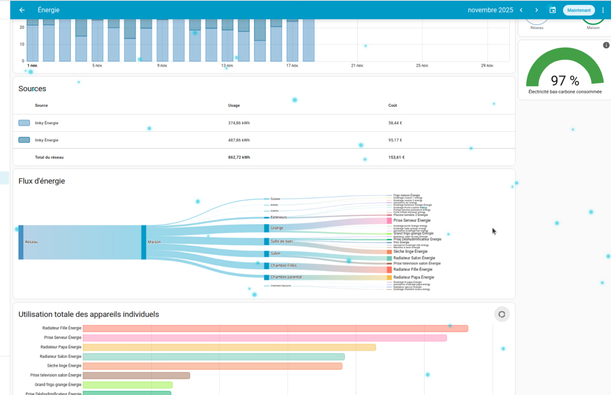
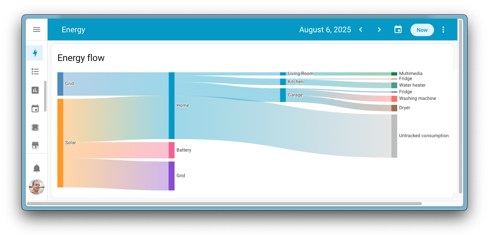
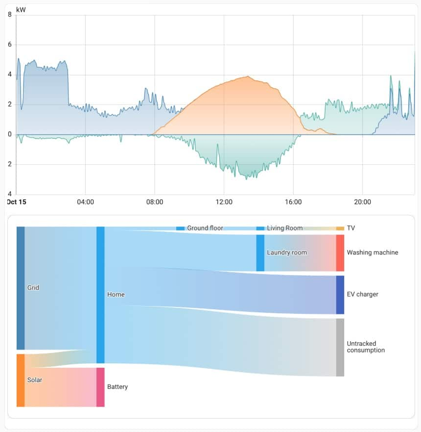
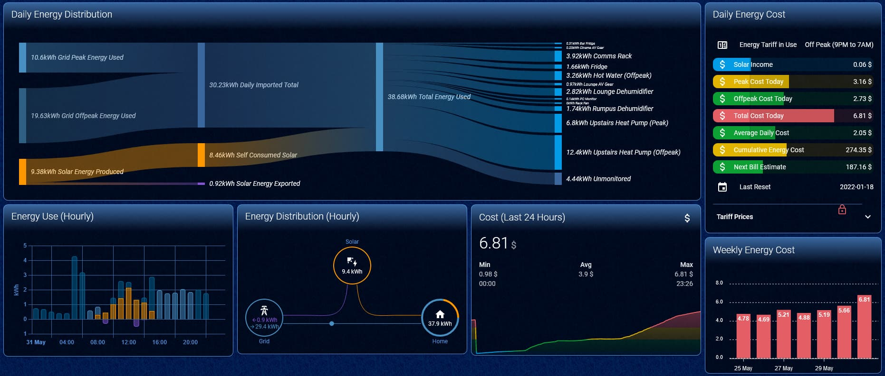
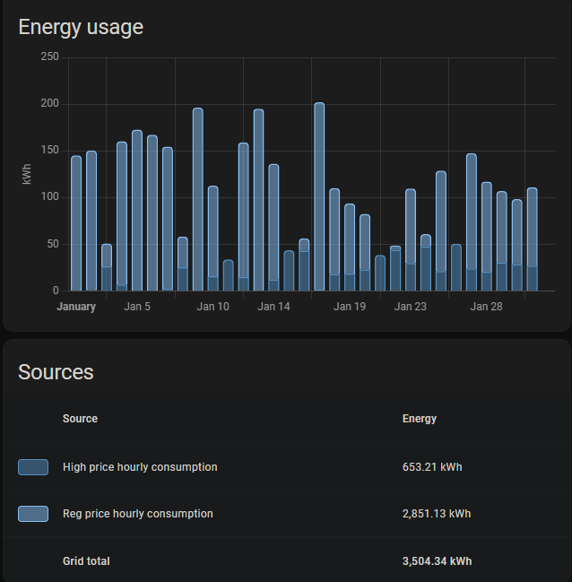

<!-- .slide: data-background="#000" class="chapter" -->

# Analyse de la consommation
____

## Revoyons les graphes précédents pour en tirer des conclusions
____

Nous avons ici la vision d'une consommation sur 15jours, on peut voir que le chauffage occupe une grosse partie de la consommation.

 <!-- .element height="70%" width="70%" -->

____

Le poste de consommation le plus important n'est pas tracké mais il est couvert par la production solaire

 <!-- .element height="70%" width="70%" -->

____

Ici la production solaire est essentiellement récupéré par les battery. Le pic de consommation a lieu pendant la nuit.

 <!-- .element height="70%" width="70%" -->

____

Une autre vue intéréssante d'une dashboard avec une vue sur le cout

 <!-- .element height="70%" width="70%" -->

____

Suivre si l'essentiel de la consommation est en HP ou HC

 <!-- .element height="70%" width="70%" -->
____

# Partage de cas particulier ?

____

## Exemple 1

Mon ballon consomme entre 8kwh et 10 kwh chaque nuit. Un ballon thermodynamique sur le même volume est annoncé entre 2 et 4kwh.

Sachant que le kwh d'EDF est à 0.21.

____

Économie par nuit : 4-8 kWh donc a l'année 1 460 à 2 920 kWh/an
Donc entre 300€ et 600€ d'économie théorique par an.

Si un ballon coute 2500€, il pourrait être amorti entre 4 à 8ans.

____

## Exemple 2

J'ai une VMC qui tourne en permanence dans une arrière cuisine. Vu le taux d'humidité elle tourne souvent pour rien et on oublige de l'éteindre.

Avec un capteur d'humidité et un interrupteur connecté, on peut programmer le démarrage et l'extinction de celle ci.

____

## Exemple 3

J'ai deux tableaux electriques, je vais dans un premier mesurer lequel des deux tableaux et le plus gros consommateurs via des capteurs.

En fonction de cela et du schéma du réseau électrique je peux alors réfléchir a ce qu'il faut surveiller.

____

## Questions ?