<!-- .slide: data-background="#000" class="chapter" -->

# Exemple de dispositifs
____

## Les capteurs

Ils remontent des données au serveur domotique
____

### Température et humidité
- Remonte la température et l'humidité, souvent fonctionne sur pile (longue longévité)

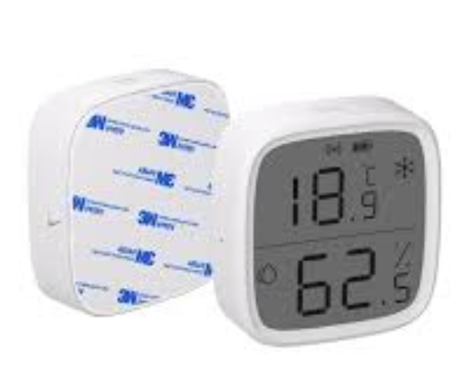 <!-- .element height="50%" width="50%" -->

____

### Détection de présence
- Détecte un passage sous le capteur

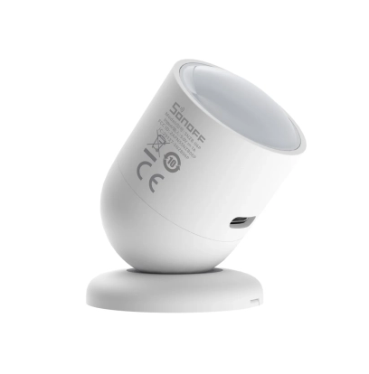 <!-- .element height="50%" width="50%" -->

____

### Capteur d'ouverture de porte
- Change d'état en fonction de l'ouverture de la porte (systeme d'aimant)

 <!-- .element height="50%" width="50%" -->

____

### Détection de fuite d'eau
- Element posé au sol pour détecter une fuite ou innondation

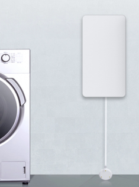 <!-- .element height="25%" width="25%" -->

____

### Taux d'humidité du sol
- Element posé dans la terre pour connaitre le taux d'humidité

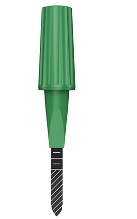 <!-- .element height="25%" width="25%" -->
____

### Détection de monoxyde, gaz ou fumée
- Element posé souvent au plafond

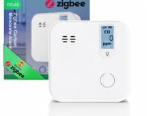 <!-- .element height="20%" width="20%" -->
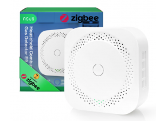 <!-- .element height="20%" width="20%" -->
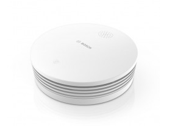 <!-- .element height="20%" width="20%" -->

____

### Niveau d'eau dans une réserve
- Connaitre le niveau d'eau de sa cuve de récupération d'eau de pluie

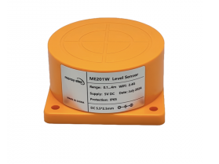 <!-- .element height="25%" width="25%" -->

____

### Consommation électrique

- Mesurer en temps réel la consommation d'un appareil
  - En coupure ou non selon la puissance
  - Fonction On/Off selon les dispositifs

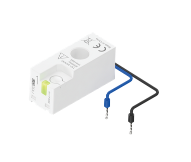 <!-- .element height="25%" width="25%" -->
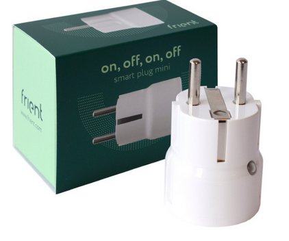 <!-- .element height="25%" width="25%" -->
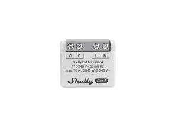 <!-- .element height="25%" width="25%" -->

*```Attention, réseau 220v à faire en connaissance de cause```* <!-- .element: style="font-size: 0.8em;" -->
____

## Les actionneurs

____

### Essentiellement des boutons et interrupteurs
- A Poser au mur en lieu et place des interrupteurs classique

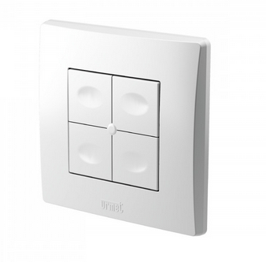 <!-- .element height="25%" width="25%" -->

____

### Des adaptateurs
- En fonction de l'appareil derrière possibilité d'utiliser des prises connectés (max puissance a voir sur la boite)

 <!-- .element height="25%" width="25%" -->

____

### Des éléments dans le tableau
- On peut aussi avoir des élements dans le tableau électrique qui peuvent faire du on/off d'un équipement (ils peuvent parfois aussi mesurer la consomation)

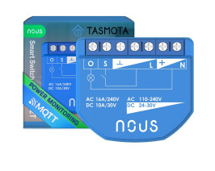 <!-- .element height="25%" width="25%" -->
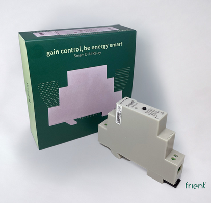 <!-- .element height="25%" width="25%" -->

____

## Que faire de tout ca

Maintenant qu'on sait ce qu'on peut mesurer, voyons un cas concret.

Comment je peux mesurer les postes de consommation électrique de ma maison