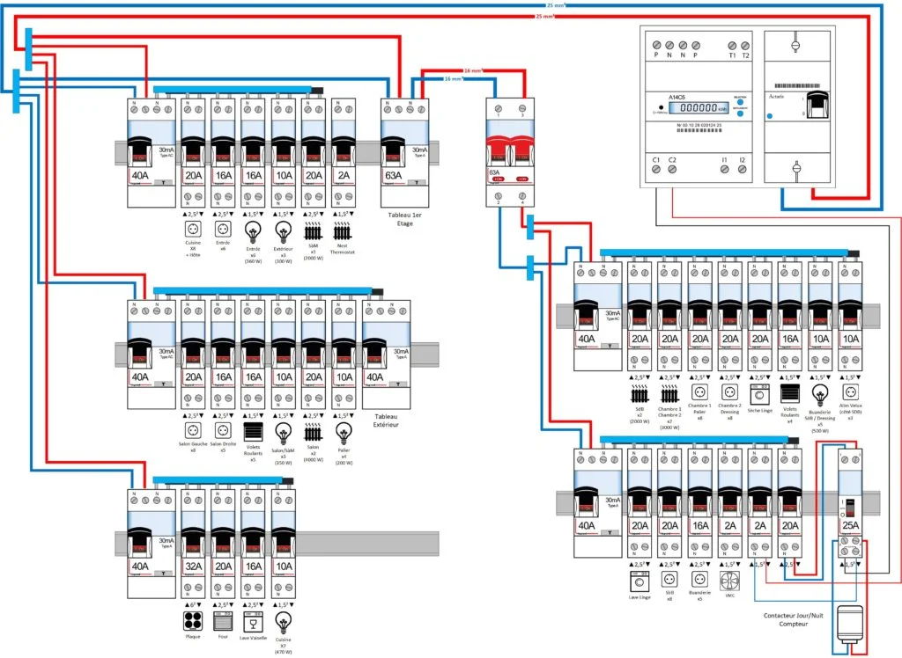
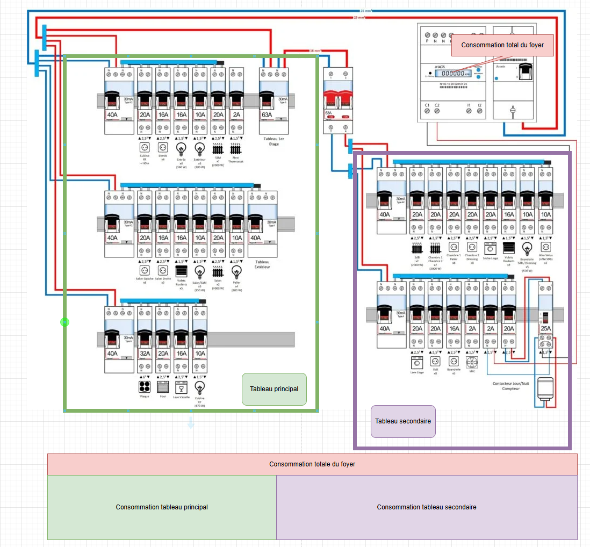
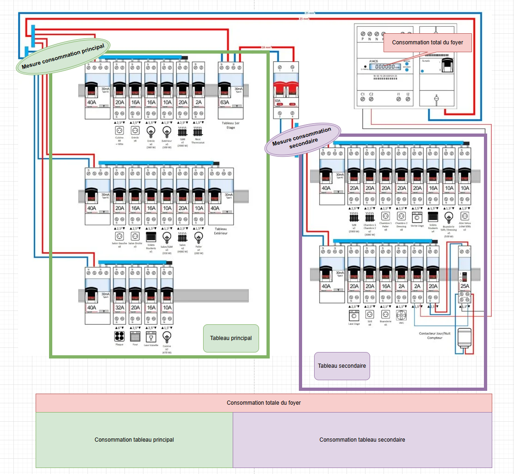
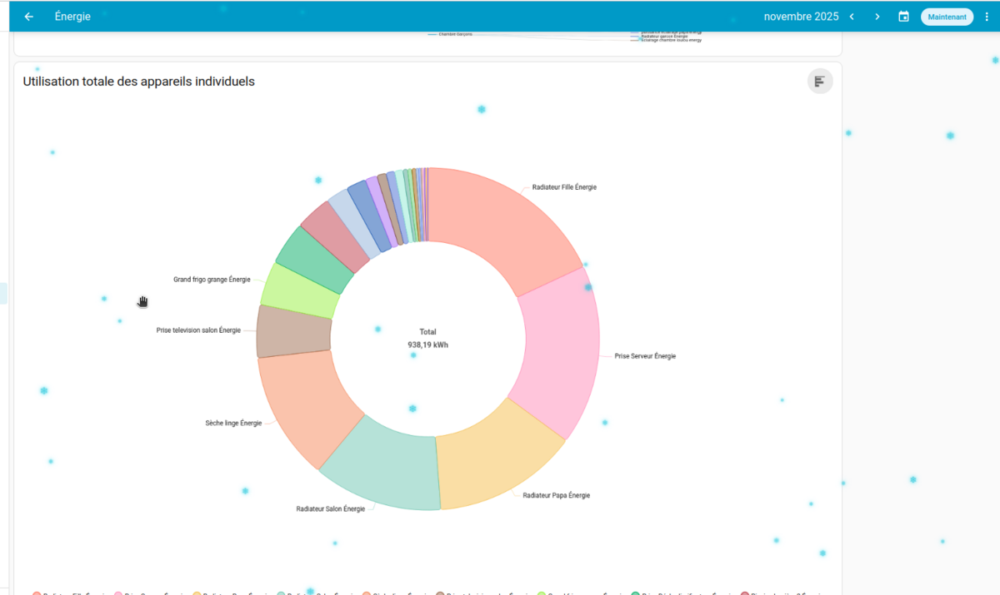
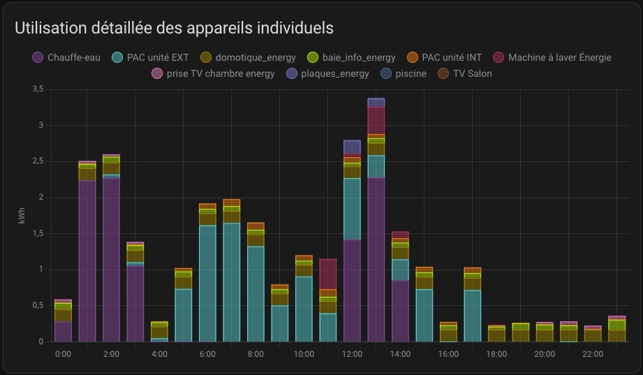

<!-- .slide: data-background="#000" class="chapter" -->

# Mesure electrique
____

## Pourquoi mesurer chez moi ?

#### J'ai pourtant mon linky qui indique ma consommation et je reçois le rapport de consommation électrique de EDF

Le linky mesure la consommation globale de votre foyer, mais ne pourra pas vous dire quels sont les gros postes de consommation de votre maison

C'est la clé, si l'on veut notamment baisser sa facture.

____

Mesurer sa consommation permettra d'en tirer des conclusions et donc des décisions

____

 On consomme beaucoup sur les heures pleines => Il faut changer nos habitudes ?

____

 Mon ballon d'eau chaude consomme vraiment beaucoup => consigne trop haute ?, ballon trop vieux et oxydé ? est-il rentable de le changer
 
____

Mon congélateur surconsomme car il surgèle => Y a t'il une différence qd je l'ai nettoyé, consomme t'il au point que ce soit rentable de le remplacer ?

____

J'ai des panneaux solaires, a quels moments ils produisent plus que je ne consomme ?

____

## Schema d'un foyer moyen

 <!-- .element height="70%" width="70%" -->

____

## Répartition

 <!-- .element height="60%" width="60%" -->
____

## Les principaux consommateurs
- Ballon d'eau chaude
- Chauffage electrique, pompe à chaleur
- Four electrique
- Lave-linge
- Lave-vaisselle
- Congélateur
- Réfrigérateur
- Eclairage
- Autre outillages ou électroménager
____

On peut aujourd'hui commencer aussi au rechargement de la voiture électrique dans les postes de consommation

____

On ne va pas tout controler, on peut s'arreter sur les usages journaliers et différencier la puissance de consommation pour faire le choix des capteurs.

Mettre des capteurs sur tous les éléments serait couteux pour peu d'interet
____

En fonction de la puissance des élements, le capteurs pour mesurer la consomation peut différer

____

Proche de ou supérieur à 2500W: mieux vos privilégier la pince ampermétrique. Aucun risque même en cas de trés grosse puissance

 <!-- .element height="20%" width="20%" -->

*```Ballon d'eau chaude, pompe à chaleur, chauffage electrique (si cumul aux alentours de 2500w), voiture electrique, four, production solaire```* <!-- .element: style="font-size: 0.8em;" -->
____

Au dessus de 2000W: Un élément de mesure directement dans le tableau suffira à condition de vérifier la puissance max supporté

 <!-- .element height="20%" width="20%" -->

*```Lave linge, chauffage electrique```* <!-- .element: style="font-size: 0.8em;" -->
____

En dessous de 2000W: Un adaptateur direct fonctionnera bien

 <!-- .element height="20%" width="20%" -->

*```Lave vaisselle, congélateur, autres```* <!-- .element: style="font-size: 0.8em;" -->
____

Notre schema electrique comporte 2 tableaux on voudra peut etre aussi mesurer le total de chaque tableau

 <!-- .element height="40%" width="40%" -->
 <!-- .element height="20%" width="20%" -->

____

## Le dashboard energie

En déclarant les équipements dans home assistant, on obtiendra alors des dashboard de notre consomation en kwh, en temps réels.

____

Exemple d'un d'un dashboard classique, on peut voir le:

 <!-- .element height="70%" width="70%" -->
____

Dans le cas de panneau solaire ils seront indiqués comme fournisseur d'énergie:

 <!-- .element height="70%" width="70%" -->

____

On peut voir des graphes journalier et donc voir a quel heure sont les pics de consommation ou production:

 <!-- .element height="70%" width="70%" -->

____

On peut avoir une répartition de la consommation par appareil surveillé:

 <!-- .element height="70%" width="70%" -->

____

Un histogramme détaillé aussi:

 <!-- .element height="70%" width="70%" -->
____

## Allons dans home assistant sur l'instance du fablab pour avoir une vue du logiciel
