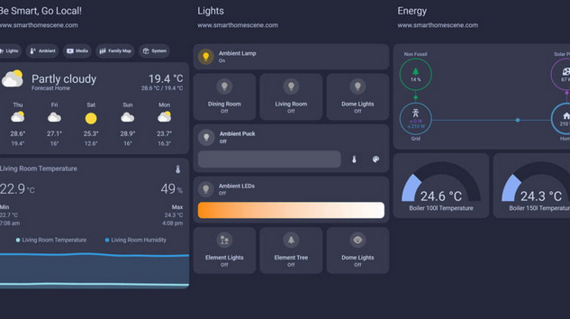
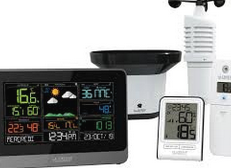
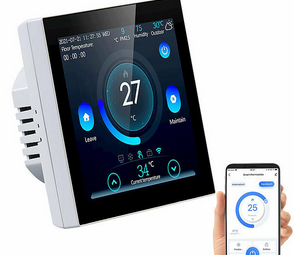
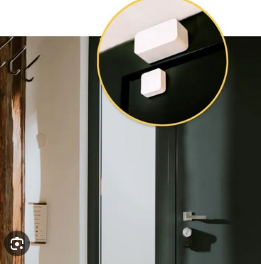
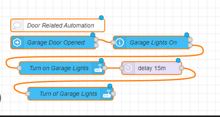
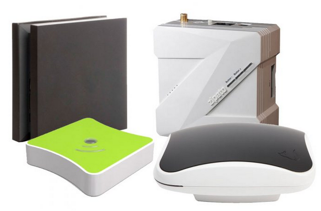
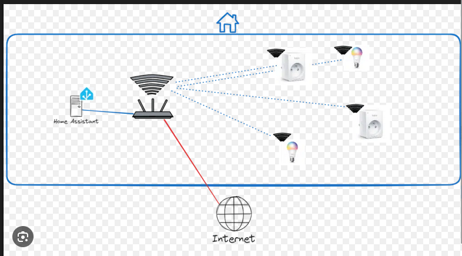
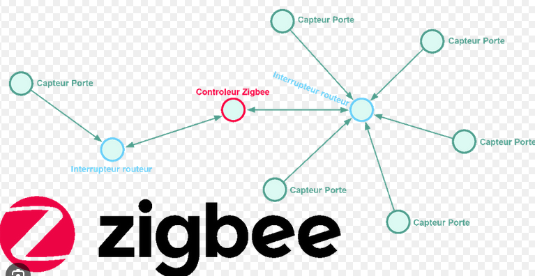

<!-- .slide: data-background="#000" class="chapter" -->

# Panorama
____

## Qu'est ce que la domotique ?

C'est obtenir à partir d'appareils connectés des informations:
  - pour consultation 
  - pour déclencher des actions automatiquements en lien avec les données

*```On peut trés bien récupérer les informations des capteurs pour un suivi sur la durée, ou simplement connaitre l'information à un instant T```* <!-- .element: style="font-size: 0.8em;" -->
____

De manière général les objets sont connectés à un serveur domotique qui centralise toutes les données et les actions. Le serveur affiche aussi l'interface à l'utilisateur

 <!-- .element height="80%" width="80%" -->

____

## Quelques exemples simples

Station météo:

 <!-- .element height="60%" width="60%" -->

____

Thermostat connecté:

 <!-- .element height="60%" width="60%" -->

____

Capteur d'ouverture de porte:

 <!-- .element height="60%" width="60%" -->

____

Mais on peut trés bien aussi en fonction des données des capteurs décider d'une action à suivre
____

- Trop de vent ou soleil couchée: fermer les volets automatiquements
____

- Porte extérieur ouverte: couper le chauffage
____

- Le congélateur ne consomme plus d'électricité depuis 12h: émettre une notification
____

- Capteur d'inondation du ballon d'eau chaude activé: émettre une sonnerie
____

Des actions plus ou moins complexe peuvent être programmée facilement via une interface web.

 <!-- .element height="60%" width="60%" -->

Les commandes vocales type google home ne sont qu'une extension de ce principe de base.

____

## Le serveur domotique

Le serveur est située sur votre réseau local (derrière votre box internet). Il s'agit d'un mini ordinateur qui conservera les données, la configuration.

Les capteurs ou actionneurs seront réliés à ce serveur via une connectivité que nous verrons par la suite.

Dans le domaine grand public il y a deux choix
____

Solution clé en main: Hardware + Software
  
   <!-- .element height="60%" width="60%" -->
  
Tout est fournit dans une box prête à l'emploi souvent lié à une marque particulière et les capteurs associés.

____

Solution open source:
  - home assistant
  - jeedom
  - ...

Développé par une communauté:
  - le modèle est souvent plus ouvert
  - moins chère
  - évolutif
  - ... mais demande plus de temps pour la prise en main.

*```On s'appuiera dans notre cas sur le logiciel home assistant```* <!-- .element: style="font-size: 0.8em;" -->

____

## La connectivité

Les capteurs, actionneurs peuvent être reliées à votre serveur par différents type de protocols selon les cas mais en général sans fil:
  - Wifi
  - Zigbee
  - Thread
  - Z-wave
  - ...
  
Nous n'aborderons aujourd'hui que le Wifi et Zigbee

____

## Wifi

Les capteurs et actionneurs seront connectés au Wifi de votre box internet ou de vos répéteurs wifi éventuels.

Ils auront alors une adresse sur votre réseau local et votre serveur communiquera avec les élements via ce réseau.

   <!-- .element height="60%" width="60%" -->

____

## Zigbee

Les capteurs et actionneurs seront connectés sur un récepteur zigbee (passerelle).

Souvent un dongle usb sur votre serveur domotique ou une passerelle zigbee vers ethernet directement relié à la box internet.

Ils n'apparaitront pas sur votre réseau wifi.
____

Principaux avantages:
  - Faible consommation (un capteur peut etre sur pile)
  - Les éléments connectés sur votre réseau électrique (ampoule connecté, prise connecté, ...) peuvent servir de répéteur du signal pour agrandir la portée de votre installation.
  
   <!-- .element height="60%" width="60%" -->

